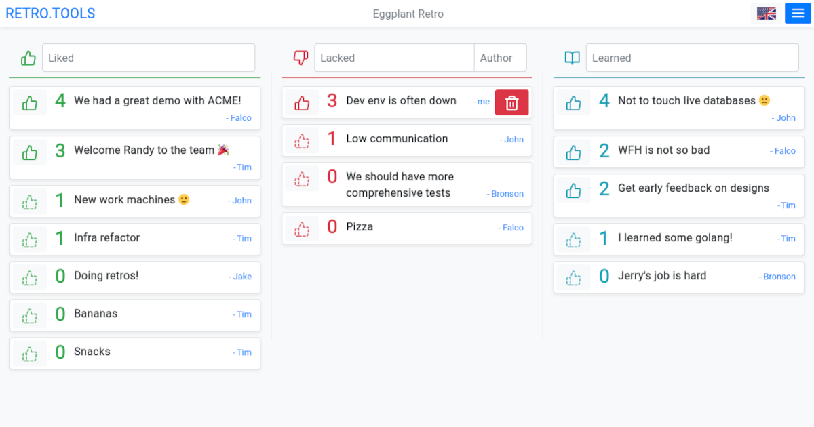
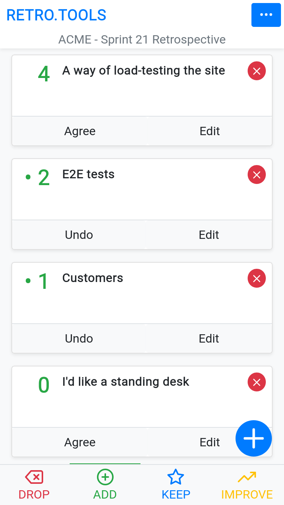

# Overview

This project is a web frontend for retrograde, an online agile retrospective tool.

It is currently hosted at [retro.tools](https://retro.tools), free for anyone to use.

The backend project lives at: [@d0x2f/retrograde.rs](https://github.com/d0x2f/retrograde.rs)

## Desktop View

## Mobile View

