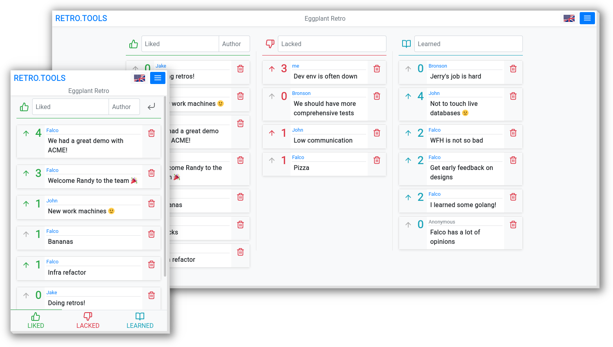

<h1 style="color:#007bff;font-weight:700;text-transform:uppercase;">RETRO.TOOLS</h1>

<h1 style="color:#007bff;font-weight:700;text-transform:uppercase;">Brief</h1>

A free and open source online retrospective meeting tool.

Hosted at [retro.tools](https://retro.tools), free for anyone to use.

The backend project lives at: [d0x2f/retrograde.rs](https://github.com/d0x2f/retrograde.rs).

<h1 style="color:#007bff;font-weight:700;text-transform:uppercase;">Features</h1>

* Simple, clean & intuitive interface
* Mobile first design
* No sign-ups, logins or tracking
* Optional encryption using a password
* Easy to share a board to your co-workers quickly with a link or an on-screen QR code
* Open source
* Multiple pre-built templates
* English, German, Korean, Russian and Spanish translations (contributions very welcome!)
